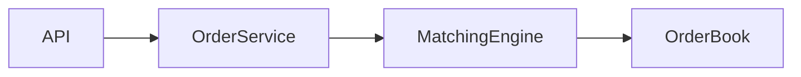
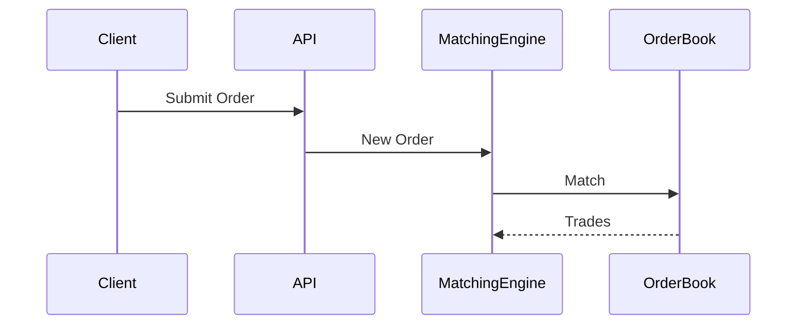
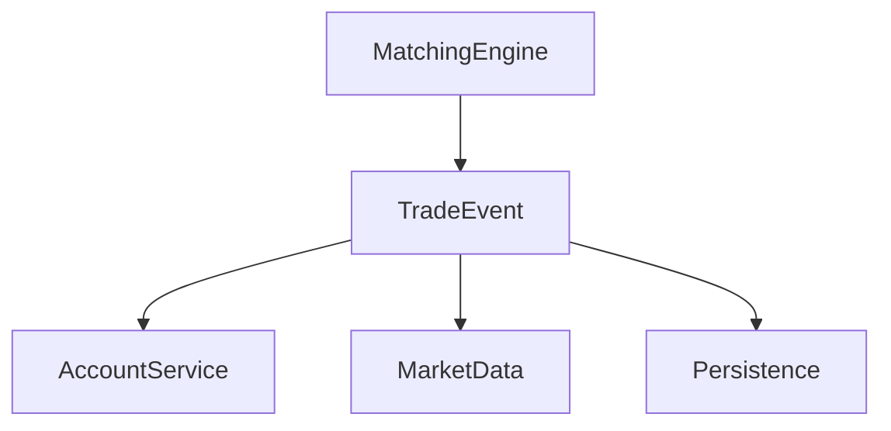

# Exchange Learning Workflow: Issue + PR Collaboration Guide

## 1. Purpose

This repository is not only used for coding practice. It is also used as a structured source-code learning project.

The goal is to learn the exchange system through a repeatable workflow:

**Question → Issue → Source Reading → Code Change / Experiment → PR → Conclusion → Long-term Notes**

The final outputs should include:

- GitHub Issues as learning and design records
- Pull Requests as implementation and experimental evidence
- Markdown notes as the long-term knowledge base
- Architecture diagrams and code snippets
- Eventually, a polished article / blog series / PDF report

The Agent should optimize for **understanding, traceability, and reusable knowledge**, not merely completing code changes.

---

# 2. Core Principle

Issues and PRs serve different purposes.

## Issue = Why / What

An Issue should primarily answer:

- What am I trying to understand?
- Why is this part of the system designed this way?
- What architectural problem does it solve?
- What alternatives exist?
- What are the trade-offs?
- What questions remain?

An Issue should NOT become a line-by-line translation of source code.

The objective is to establish a mental model of the system.

## PR = How / Evidence

A Pull Request should primarily answer:

- What code path was inspected?
- What code was changed?
- What experiment was performed?
- What behavior was verified?
- What evidence supports the conclusion in the Issue?

A PR can include:

- tests
- tracing
- logging
- benchmarks
- small refactors
- bug reproductions
- documentation
- diagrams
- small feature implementations

A PR does not have to introduce a production feature.

A learning-oriented PR is valid if it provides concrete evidence for understanding the system.

---

# 3. Labels

Use the following four main labels.

## `architecture`

System architecture, component interactions, data flow, and design trade-offs.

Typical topics:

- overall system architecture
- order lifecycle
- module boundaries
- matching architecture
- persistence strategy
- event flow
- concurrency model
- failure recovery

Example:

> Why does WarpExchange keep the matching engine in memory?

---

## `code-reading`

Source-code walkthroughs focused on implementation details and execution paths.

Typical topics:

- tracing one API request
- following a LIMIT order
- reading OrderBook implementation
- understanding partial fill
- understanding cancellation
- locating domain models
- studying important abstractions

Example:

> Trace a LIMIT BUY order from API to OrderBook.

---

## `experiment`

Experiments, benchmarks, tracing, and tests used to validate system behavior.

Typical topics:

- throughput benchmark
- latency measurement
- concurrency testing
- stress testing
- failure simulation
- tracing
- profiling
- deterministic behavior verification

Example:

> Benchmark matching performance with 100k orders.

---

## `improvement`

Refactors, feature enhancements, and architectural improvements to the existing system.

Typical topics:

- small refactoring
- persistence prototype
- WebSocket enhancement
- improved tests
- improved observability
- alternative architecture prototype
- documentation improvements

Example:

> Prototype a simple WAL for matching-engine recovery.

Do not create new labels unless there is a clear recurring need.

---

# 4. Issue Structure

Each learning Issue should follow approximately this structure.

```markdown
# Title

A question-oriented title is preferred.

Example:

Why does the matching engine use in-memory state?

## Goal

What do we want to understand or verify?

## Context

Why is this question important?

Which part of the exchange system does it affect?

## Current Understanding

Describe the current mental model before deeper investigation.

It is acceptable for this section to contain assumptions.

Clearly mark uncertain assumptions.

## Architecture / Data Flow

Describe the relevant components.

Use Mermaid diagrams whenever useful.

Example:

API
↓
OrderService
↓
MatchingEngine
↓
OrderBook
↓
Trade Events

## Code Path

List the most important classes, functions, or modules.

Example:

POST /orders

OrderController
→ OrderService
→ MatchingEngine
→ OrderBook

Avoid listing every file.

Focus on the critical execution path.

## Key Code

Include only small, relevant code slices.

Each code slice must explain a concept.

Do not include code merely for completeness.

For each snippet, answer:

- What does this code do?
- Why is it important?
- What system concept does it implement?

## Design Choice

Explain the current design.

Example:

Option A: database-driven matching

Option B: in-memory matching

Current project chooses Option B.

## Trade-offs

Discuss both benefits and costs.

Possible dimensions:

- latency
- throughput
- complexity
- durability
- consistency
- scalability
- maintainability
- observability
- recovery

## Experiment / Verification Plan

If applicable, describe how the understanding will be verified.

Examples:

- write a unit test
- add tracing
- run benchmark
- simulate crash
- inspect runtime state
- create small prototype

Link the corresponding PR when available.

## Findings

Update this section after investigation.

Summarize the actual conclusion.

Separate facts from interpretation.

## What I Learned

Write 3–5 concise reusable lessons.

These should remain useful even if the specific source code later changes.

## Open Questions

List unresolved questions.

These can become future Issues.

## Related

- Related Issue:
- Related PR:
- Related notes:
```

---

# 5. Good Issue Titles

Prefer question-oriented or investigation-oriented titles.

Good:

- Why does the matching engine keep the OrderBook in memory?
- Trace the lifecycle of a LIMIT BUY order
- How does partial fill work?
- How is account balance frozen before matching?
- What happens if the matching process crashes?
- Benchmark matching throughput with 100k orders

Avoid vague titles:

- Learn OrderBook
- Study matching
- Read code
- Improve code
- Test project

The title should communicate the exact learning target.

---

# 6. Pull Request Structure

Each PR should normally reference one primary Issue.

Use:

```markdown
Closes #<issue-number>
```

only when the Issue should truly be completed after merging.

Otherwise use:

```markdown
Related to #<issue-number>
```

Recommended PR template:

```markdown
## Purpose

What question does this PR help answer?

Related Issue: #XX

## Changes

Describe the concrete code changes.

Examples:

- added unit tests for partial fills
- added benchmark script
- added tracing around matching
- refactored code to expose behavior more clearly

## Code Path

Main execution path investigated:

A
→ B
→ C

## Evidence

What behavior was observed?

Include:

- test results
- benchmark results
- logs
- screenshots when genuinely useful
- relevant code snippets

## Findings

What did this implementation or experiment prove?

## Design Notes

What trade-offs or architectural observations were discovered?

## Limitations

What does this PR NOT prove?

What remains uncertain?

## Follow-up

Possible next Issues or PRs.
```

---

# 7. PR Size

Prefer small, reviewable PRs.

One PR should normally answer one main question.

Good:

> Add tests to verify price-time priority.

Less good:

> Refactor matching engine, add frontend, redesign database, add benchmarks, update all documentation.

Large learning tasks should be split into several Issues and PRs.

The objective is to preserve a clean reasoning history.

---

# 8. Code Snippet Rules

Code snippets are learning artifacts, not decoration.

Use snippets only when they represent an important concept.

Bad:

```java
public void foo() {
    ...
}
```

followed by a translation of every line.

Good:

```java
while (bestBid >= bestAsk) {
    match();
}
```

Then explain:

- this is the price-crossing condition
- matching continues while bid price crosses ask price
- once the condition fails, the current book is no longer immediately matchable

Always convert:

**code → concept**

Do not produce:

**code → Chinese paraphrase**

---

# 9. Diagrams

Use Mermaid whenever diagrams improve understanding.

Recommended diagram types:

## Component Diagram



## Request Flow



## Event Flow



Diagrams should simplify the system.

Do not include every class.

---

# 10. Experiments

Whenever possible, turn assumptions into experiments.

Examples:

Instead of:

> I think this code preserves price-time priority.

Prefer:

> Write a test containing multiple orders at the same price and verify execution order.

Instead of:

> The matching engine should be fast because it is in memory.

Prefer:

> Benchmark 1k / 10k / 100k orders and record throughput.

Instead of:

> Crash recovery seems weak.

Prefer:

> Simulate process termination and inspect what state can be reconstructed.

A strong learning loop is:

**Hypothesis → Experiment → Result → Interpretation**

---

# 11. Architecture Review Mindset

Do not stop at understanding what the repository currently does.

For important components, also ask:

> If this were a production exchange, what would need to change?

Possible areas:

- durability
- WAL
- event sourcing
- deterministic sequencing
- sharding
- high availability
- disaster recovery
- risk control
- observability
- backpressure
- security
- consistency

Create a clear distinction between:

### Current Repository Design

What WarpExchange actually implements.

### Production-Level Alternative

How a real-world system might differ.

Do not criticize the repository merely because it is educational or simplified.

Explain the reason behind the simplification and its trade-offs.

---

# 12. Notes Repository

Markdown is the single source of truth.

Avoid maintaining independent copies in:

- GitHub
- Obsidian
- Blog
- PDF

Instead use one Markdown-based note structure.

Suggested structure:

```text
notes/

00-overview.md

01-architecture/
    system-overview.md
    request-flow.md

02-orderbook/
    orderbook.md
    price-time-priority.md

03-matching/
    matching-engine.md
    partial-fill.md
    cancellation.md

04-account/
    balance.md
    settlement.md

05-experiments/
    benchmark.md
    concurrency.md

06-design/
    production-exchange.md
```

Issue and PR content should eventually be distilled into these notes.

---

# 13. Issue vs Final Notes

Do not directly concatenate Issues into the final document.

Issues are chronological investigation records.

Final notes should be organized conceptually.

Issue structure:

```text
Question 1
Question 2
Experiment 1
Bug 1
Question 3
```

Final document structure:

```text
Architecture
OrderBook
Matching
Accounts
Persistence
Experiments
Production Design
```

The final notes should represent the clean mental model obtained after investigation.

---

# 14. Final Publishing Goal

The long-term output may become:

```text
Reverse Engineering an Exchange from Source Code
```

Possible final structure:

```text
1. System Overview
2. Order Lifecycle
3. OrderBook
4. Matching Engine
5. Account and Settlement
6. Event Architecture
7. Persistence and Recovery
8. Experiments
9. Design Trade-offs
10. How I Would Redesign It
```

Potential publishing formats:

- GitHub repository
- Markdown
- personal blog
- PDF
- interview portfolio

The final output should demonstrate:

- source-code reading
- architecture understanding
- experimentation
- engineering judgment
- ability to explain design trade-offs

---

# 15. Agent Responsibilities

When helping with an Issue, the Agent should:

1. Read the relevant source code before making conclusions.
2. Identify the minimum critical execution path.
3. Explain architecture before implementation details.
4. Clearly separate facts, assumptions, and hypotheses.
5. Suggest experiments when behavior can be verified.
6. Avoid generating unnecessary large code changes.
7. Prefer small, focused PRs.
8. Reference exact files/classes/functions when relevant.
9. Produce Mermaid diagrams when useful.
10. Update findings after code or experiments provide evidence.
11. Identify meaningful follow-up questions.
12. Help distill finished Issues into permanent notes.

---

# 16. What the Agent Should Avoid

Do not:

- summarize every source file
- explain every line of code
- generate large refactors without a learning purpose
- create PRs merely to create activity
- invent architectural intentions unsupported by code
- treat assumptions as facts
- produce long generic textbook explanations unrelated to the repository
- over-document trivial implementation details
- duplicate the same explanation across Issue, PR, and notes

The Agent should continuously ask:

> Does this help build a better mental model of the system?

If not, reduce or remove it.

---

# 17. Suggested Initial Roadmap

Start small.

A first learning cycle can contain approximately:

```text
8 Issues
6 PRs
```

Example:

## Issue 01 — architecture

Understand the overall exchange architecture.

Possible output:

- component diagram
- main modules
- important domain concepts

No PR required.

---

## Issue 02 — code-reading

Trace a LIMIT BUY order.

PR:

Add tracing or tests that make the lifecycle observable.

---

## Issue 03 — architecture

Understand OrderBook design and price-time priority.

PR:

Add tests verifying ordering behavior.

---

## Issue 04 — code-reading

Understand partial fills and cancellation.

PR:

Add edge-case tests.

---

## Issue 05 — architecture

Understand account balance and settlement.

PR:

Add tests or diagrams for balance transitions.

---

## Issue 06 — experiment

Benchmark matching throughput.

PR:

Add reusable benchmark code.

---

## Issue 07 — architecture

Investigate persistence and crash recovery.

PR:

Optional recovery experiment.

---

## Issue 08 — improvement

Write a production architecture review.

Compare the educational implementation with a possible production exchange architecture.

No large implementation is required.

---

# 18. Definition of Done

An Issue is considered complete when:

- the original question has a clear answer
- the relevant code path has been identified
- important design choices are explained
- assumptions have been verified where practical
- corresponding PRs are linked
- remaining uncertainties are explicitly recorded
- reusable lessons have been extracted

A PR is considered complete when:

- it has one clear learning purpose
- the change is reasonably small
- evidence/results are recorded
- it references the related Issue
- conclusions are reflected back into the Issue

A topic is fully complete when its useful conclusions have also been distilled into the permanent Markdown notes.

---

# 19. Working Philosophy

The objective is not to maximize:

- number of commits
- number of Issues
- number of PRs
- amount of generated documentation

The objective is to maximize:

**understanding per unit of work.**

Every Issue and PR should leave behind useful evidence of how the system works and why it was designed that way.