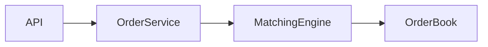
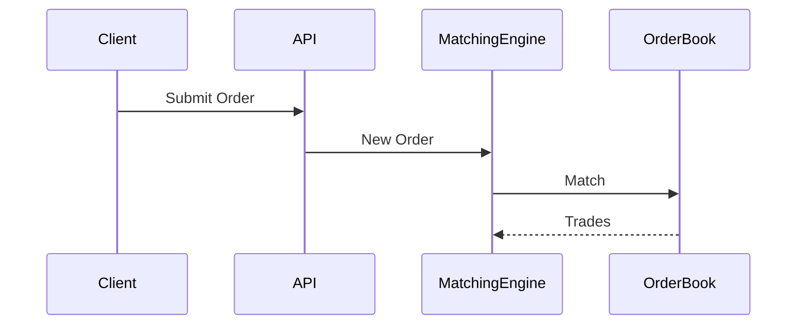
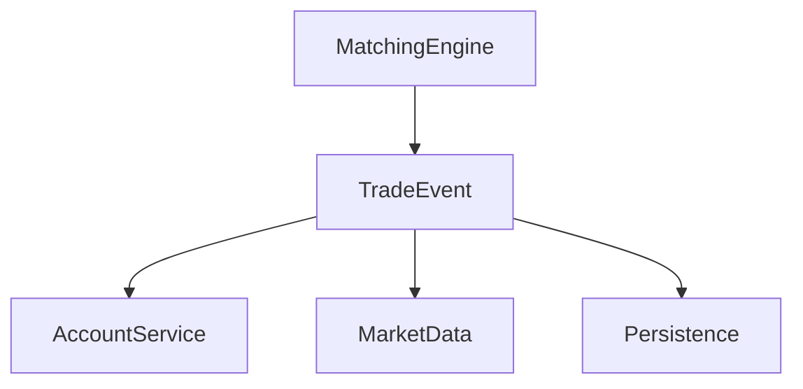

# Exchange Learning Workflow: Issue + PR Collaboration Guide

## 1. Purpose

This repository is not only used for coding practice. It is also used as a structured source-code learning project.

The goal is to learn the exchange system through a repeatable workflow:

**Question → Issue → Source Reading → Code Change / Experiment → PR → Conclusion → Long-term Notes**

The final outputs should include:

- GitHub Issues as learning and design records
- Pull Requests as implementation and experimental evidence
- Markdown notes as the long-term knowledge base
- Architecture diagrams and code snippets
- Eventually, a polished article / blog series / PDF report

The Agent should optimize for **understanding, traceability, and reusable knowledge**, not merely completing code changes.

---

# 2. Core Principle

Issues and PRs serve different purposes.

## Issue = Why / What

An Issue should primarily answer:

- What am I trying to understand?
- Why is this part of the system designed this way?
- What architectural problem does it solve?
- What alternatives exist?
- What are the trade-offs?
- What questions remain?

An Issue should NOT become a line-by-line translation of source code.

The objective is to establish a mental model of the system.

## PR = How / Evidence

A Pull Request should primarily answer:

- What code path was inspected?
- What code was changed?
- What experiment was performed?
- What behavior was verified?
- What evidence supports the conclusion in the Issue?

A PR can include:

- tests
- tracing
- logging
- benchmarks
- small refactors
- bug reproductions
- documentation
- diagrams
- small feature implementations

A PR does not have to introduce a production feature.

A learning-oriented PR is valid if it provides concrete evidence for understanding the system.

---

# 3. Labels and Milestones

标签按用途组合，不要求每个 Issue 都有全部类别。

| 用途 | 标签 | 规则 |
| --- | --- | --- |
| 学习方向 | `architecture`、`code-reading`、`experiment` | 学习任务选一个主要方向，确有需要再加第二个 |
| 改动类型 | `enhancement`、`bug`、`documentation`、`chore` | 开发任务选择一个主要类型；纯阅读无需硬加开发标签 |
| 任务层级 | `main-issue`、`sub-issue` | 主任务与子任务二选一；独立任务可以不加 |

- `documentation` 是文档标签；`docs:` 仍可用于分支或提交，不创建 `docs` 标签。
- `improvement` 不再用于新任务：新功能用 `enhancement`，修复用 `bug`，文档用 `documentation`，维护、独立测试补充或不改变行为的重构用 `chore`。旧标签保留用于历史检索。
- `epic` 仅用于跨模块的大型提案，不代替父子关系。
- `sub-issue` 标签只是分类，必须同时通过 GitHub 建立真实的父子关系。
- 主线学习和开发挂 `v1.0 交易所主线（MVP）`；增强功能挂 `v2 功能增强`；永续合约挂 `v3.0 永续合约引擎`。子任务默认继承父任务的里程碑。
- 不为一次性的分类随意新建标签。

# 4. Issue Structure and Task Boundaries

默认使用下面的简版。创建时写清问题、范围、验证方式和关联；结果在实际完成后填写，不提前编写。

```markdown
## 目标
想搞懂什么，或者要完成什么？为什么现在做？

## 当前理解
目前怎么理解？不确定的地方直接标出来。

## 范围与验证
- [ ] 准备读什么、改什么或做什么实验？
- [ ] 怎样判断完成？

## 结果
完成后补充简短结论、证据链接和剩余问题。

## 关联
父 Issue（如有）：
前置任务（如有）：
PR / 笔记（产生后补充）：
```

架构图、关键代码、设计取舍、实验细节按需要添加，不要求填满所有栏目。开发任务可以省略“当前理解”；纯阅读任务也不必虚构代码改动。GitHub 对应模板在 `.github/ISSUE_TEMPLATE/`。

## 主 Issue、子 Issue 和 PR 各写什么

| 位置 | 主要内容 |
| --- | --- |
| 主 Issue | 本轮范围、子任务顺序、总体验收；链接到各子任务，不复制它们的详细结论 |
| 子 Issue | 一个具体问题或一块工作、完成条件、简短结果和证据链接 |
| PR | 实际改动、验证证据和相关 Issue |
| 学习笔记 | 整理后的长期解释；Issue 和 PR 用链接引用 |

- 能在一个小任务里讲清的问题，不强行拆成阅读、实现、实验三个 Issue。
- 一个子 Issue 可以对应多个 PR，一个 PR 也可以完成紧密相关的多个子 Issue；PR 仍应有一个清楚的主要目的。
- 前置任务只写必要依赖。完成子任务后更新父任务进度，不自动认定父任务完成。
- 纯阅读任务有明确结论和源码依据即可关闭，无需为了流程创建 PR。
- 子任务完成自己的验收后关闭；父任务在本轮必需子任务及总体验收全部完成后关闭。延期或取消的范围必须在父任务明确说明，不能只看关闭数量。
- 本轮之外的问题记为后续任务，不让当前 Issue 无限扩大。

---

# 5. Good Issue Titles

Prefer question-oriented or investigation-oriented titles.

Good:

- Why does the matching engine keep the OrderBook in memory?
- Trace the lifecycle of a LIMIT BUY order
- How does partial fill work?
- How is account balance frozen before matching?
- What happens if the matching process crashes?
- Benchmark matching throughput with 100k orders

Avoid vague titles:

- Learn OrderBook
- Study matching
- Read code
- Improve code
- Test project

The title should communicate the exact learning target.

---

# 6. Pull Request Structure

默认使用简版模板，GitHub 对应文件为 `.github/pull_request_template.md`。

```markdown
## 目的与关联
这次解决什么问题？
Related to #N

## 改动
具体改了什么？

## 验证
运行了什么命令或检查？结果怎样？未执行的验证写清原因。

## 结论与后续
本次确认了什么？还有哪些限制或后续任务？没有可省略。
```

- 只有合并后确实满足某个 Issue 的全部验收，才把 `Related to #N` 改成 `Closes #N`。
- 一个 PR 可以列出多个准确的关联；不要因为完成一个子任务就写 `Closes` 父 Issue。
- 无法在合并前补齐 Issue 结论时，先用 `Related to`，补齐后再手动关闭。
- 代码路径、截图、日志、设计取舍按需添加，不重复整份 Issue。

## 实现与测试一起交付

实现 PR 必须包含证明本次基本行为正确的测试，尤其是资产、订单和清算逻辑。不能把必要测试全部留给后续实验任务。纯文档和模板变更做对应文档检查，无需增加业务测试。

- 基本测试：正常路径、主要失败路径、核心不变量，与实现一起提交和验证。
- 独立实验任务：更复杂的边界组合、故障模拟、并发研究或性能测试；依赖已经有基本验证的实现。
- 需要拆成多个 PR 时，每个可合并的实现增量都要有对应基本测试；实验发现的问题在修复后重跑相关测试。
- 例如 Step 2：#29 同时实现资产操作并测试三种转账、余额不足和基本守恒；#30 再研究连续小数操作、多用户多币种和边界组合。两个任务可以共享一个范围清楚的 PR，不要求一一对应。

---

# 7. PR Size

Prefer small, reviewable PRs.

One PR should normally answer one main question.

Good:

> Add tests to verify price-time priority.

Less good:

> Refactor matching engine, add frontend, redesign database, add benchmarks, update all documentation.

Large learning tasks should be split into several Issues and PRs.

The objective is to preserve a clean reasoning history.

---

# 8. Code Snippet Rules

Code snippets are learning artifacts, not decoration.

Use snippets only when they represent an important concept.

Bad:

```java
public void foo() {
    ...
}
```

followed by a translation of every line.

Good:

```java
while (bestBid >= bestAsk) {
    match();
}
```

Then explain:

- this is the price-crossing condition
- matching continues while bid price crosses ask price
- once the condition fails, the current book is no longer immediately matchable

Always convert:

**code → concept**

Do not produce:

**code → Chinese paraphrase**

---

# 9. Diagrams

Use Mermaid whenever diagrams improve understanding.

Recommended diagram types:

## Component Diagram



## Request Flow



## Event Flow



Diagrams should simplify the system.

Do not include every class.

---

# 10. Experiments

Whenever possible, turn assumptions into experiments.

Examples:

Instead of:

> I think this code preserves price-time priority.

Prefer:

> Write a test containing multiple orders at the same price and verify execution order.

Instead of:

> The matching engine should be fast because it is in memory.

Prefer:

> Benchmark 1k / 10k / 100k orders and record throughput.

Instead of:

> Crash recovery seems weak.

Prefer:

> Simulate process termination and inspect what state can be reconstructed.

A strong learning loop is:

**Hypothesis → Experiment → Result → Interpretation**

---

# 11. Architecture Review Mindset

Do not stop at understanding what the repository currently does.

For important components, also ask:

> If this were a production exchange, what would need to change?

Possible areas:

- durability
- WAL
- event sourcing
- deterministic sequencing
- sharding
- high availability
- disaster recovery
- risk control
- observability
- backpressure
- security
- consistency

Create a clear distinction between:

### Current Repository Design

What WarpExchange actually implements.

### Production-Level Alternative

How a real-world system might differ.

Do not criticize the repository merely because it is educational or simplified.

Explain the reason behind the simplification and its trade-offs.

---

# 12. Notes Repository

Markdown is the single source of truth.

Avoid maintaining independent copies in:

- GitHub
- Obsidian
- Blog
- PDF

Instead use one Markdown-based note structure.

Suggested structure:

```text
notes/

00-overview.md

01-architecture/
    system-overview.md
    request-flow.md

02-orderbook/
    orderbook.md
    price-time-priority.md

03-matching/
    matching-engine.md
    partial-fill.md
    cancellation.md

04-account/
    balance.md
    settlement.md

05-experiments/
    benchmark.md
    concurrency.md

06-design/
    production-exchange.md
```

Issue and PR content should eventually be distilled into these notes.

---

# 13. Issue vs Final Notes

Do not directly concatenate Issues into the final document.

Issues are chronological investigation records.

Final notes should be organized conceptually.

Issue structure:

```text
Question 1
Question 2
Experiment 1
Bug 1
Question 3
```

Final document structure:

```text
Architecture
OrderBook
Matching
Accounts
Persistence
Experiments
Production Design
```

The final notes should represent the clean mental model obtained after investigation.

---

# 14. Final Publishing Goal

The long-term output may become:

```text
Reverse Engineering an Exchange from Source Code
```

Possible final structure:

```text
1. System Overview
2. Order Lifecycle
3. OrderBook
4. Matching Engine
5. Account and Settlement
6. Event Architecture
7. Persistence and Recovery
8. Experiments
9. Design Trade-offs
10. How I Would Redesign It
```

Potential publishing formats:

- GitHub repository
- Markdown
- personal blog
- PDF
- interview portfolio

The final output should demonstrate:

- source-code reading
- architecture understanding
- experimentation
- engineering judgment
- ability to explain design trade-offs

---

# 15. Agent Responsibilities

When helping with an Issue, the Agent should:

1. Read the relevant source code before making conclusions.
2. Identify the minimum critical execution path.
3. Explain architecture before implementation details.
4. Clearly separate facts, assumptions, and hypotheses.
5. Suggest experiments when behavior can be verified.
6. Avoid generating unnecessary large code changes.
7. Prefer small, focused PRs.
8. Reference exact files/classes/functions when relevant.
9. Produce Mermaid diagrams when useful.
10. Update findings after code or experiments provide evidence.
11. Identify meaningful follow-up questions.
12. Help distill finished Issues into permanent notes.

---

# 16. What the Agent Should Avoid

Do not:

- summarize every source file
- explain every line of code
- generate large refactors without a learning purpose
- create PRs merely to create activity
- invent architectural intentions unsupported by code
- treat assumptions as facts
- produce long generic textbook explanations unrelated to the repository
- over-document trivial implementation details
- duplicate the same explanation across Issue, PR, and notes

The Agent should continuously ask:

> Does this help build a better mental model of the system?

If not, reduce or remove it.

---

# 17. Suggested Initial Roadmap

Start small.

下面仅是可选选题，不是数量要求，也不是每轮都要照搬的任务拆分。已有主任务和子任务时优先复用。

Example:

## Issue 01 — architecture

Understand the overall exchange architecture.

Possible output:

- component diagram
- main modules
- important domain concepts

No PR required.

---

## Issue 02 — code-reading

Trace a LIMIT BUY order.

PR:

Add tracing or tests that make the lifecycle observable.

---

## Issue 03 — architecture

Understand OrderBook design and price-time priority.

PR:

Add tests verifying ordering behavior.

---

## Issue 04 — code-reading

Understand partial fills and cancellation.

PR:

Add edge-case tests.

---

## Issue 05 — architecture

Understand account balance and settlement.

PR:

Add tests or diagrams for balance transitions.

---

## Issue 06 — experiment

Benchmark matching throughput.

PR:

Add reusable benchmark code.

---

## Issue 07 — architecture

Investigate persistence and crash recovery.

PR:

Optional recovery experiment.

---

## Issue 08 — architecture + documentation

Write a production architecture review.

Compare the educational implementation with a possible production exchange architecture.

No large implementation is required.

---

# 18. Definition of Done

子 Issue 完成时：

- 本任务的问题有答案或工作达到验收要求。
- 有适合该任务的证据：阅读任务给源码依据，实现任务给基本测试，实验任务给实际结果。
- 写明简短结论、限制和后续问题；有 PR 就关联，没有代码或文档改动时不强求 PR。
- 更新父任务进度（如有）。

PR 可合并时：

- 改动目的清楚，包含必要的基本测试或与变更相符的检查，实际结果已记录。
- 关联正确的 Issue，`Closes` 仅用于全部验收已满足的任务。
- 关键结论回填 Issue 或链接到对应证据，不复制长篇说明。
- 满足 AGENTS.md 中的构建和合并规则。

主 Issue 完成时：

- 本轮必需子任务完成，总体验收通过。
- 推迟或取消的内容及原因已明确说明，后续安排可追踪。
- 有价值的结论已按本轮需要整理到学习笔记并链接，不要求每个小 Issue 都单独写一篇笔记。

---

# 19. Working Philosophy

The objective is not to maximize:

- number of commits
- number of Issues
- number of PRs
- amount of generated documentation

The objective is to maximize:

**understanding per unit of work.**

Every Issue and PR should leave behind useful evidence of how the system works and why it was designed that way.