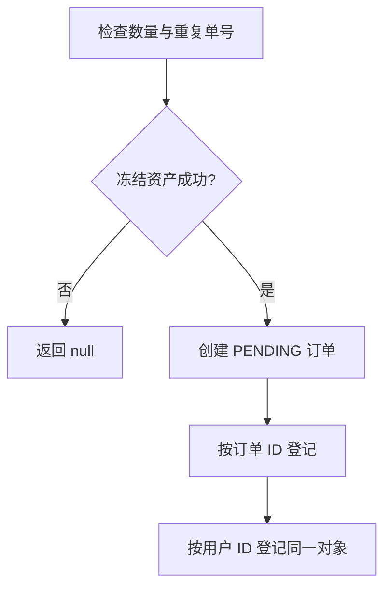

# 订单系统（Step 3）

订单层把“用户有多少资产”变成“哪些资产正在为哪张订单服务”。本篇以[教程正文和相关评论](https://liaoxuefeng.com/books/java/springcloud/engine/order/index.html)为概念来源，对照本仓库实现与 PR #43 的测试证据；当前范围见 #37。

## 1. 活动订单与历史订单

教程把订单系统定位为内存中的活动订单工作集：按单号查单、按用户列出订单；终态订单退出工作集，历史查询走数据库。这解释了 OrderEntity 同时承担内存模型与数据库映射模型的简化设计。

当前仓库只完成建档、查询和移除。JPA 注解是映射元数据，尚未实现订单历史落库、撮合、清算或 REST 查询，不能把教程完整系统的数据流当成已经运行的功能。

## 2. 冻结规则来自交付义务

| 方向 | 成交时需要交出的资产 | 创建时冻结 |
| --- | --- | --- |
| BUY | USD | price × quantity |
| SELL | BTC | quantity |

教程评论中，作者用持有股票但没有现金的卖家解释卖单为什么不冻结价款。对应到 BTC/USD，价格决定卖家未来收到多少 USD，冻结的却是要交出的 BTC。

本仓库先拒绝非正数量和重复 orderId，再调用 tryFreeze，成功后才创建并登记订单。已有测试证明：余额不足返回 null，不建档；重复订单及非正数量在冻结前被拒绝。

评论区关于事务的问答解释了这种内存操作顺序。本项目应把它理解为受信输入、单写者约束下的正常路径约定，而非通用事务或回滚机制：字段构造和索引写入若发生意外异常，没有自动回滚。价格边界尚未建立，后续见 #45。

## 3. 双索引是两个入口，共享一个对象

```java
activeOrders.put(orderId, order);
userOrders.computeIfAbsent(userId, id -> new ConcurrentHashMap<>())
          .put(order.id, order);
```

这两处登记服务于不同查询入口，但指向同一个 OrderEntity。已有 assertSame 断言证明这一点。单个索引的线程安全不能保证两个索引始终以原子方式一起变化。



removeOrder 先从 activeOrders 删除，再从订单上的 userId 找到用户索引并删除。任一处缺失都会抛异常；它不解冻，也不改变订单状态。清算和撤单对资产的处理属于后续阶段。

现有异常测试通过 getUserOrders 返回的活 map 删除一项，再调用 removeOrder，观察到异常和部分删除。由此可知：公开 getter 可以破坏索引，“公开 API 无法构造不一致”是不准确的说明。

当前保留可写 map，并把调用者不修改它作为约定。后续 #44 决定是否改成只读视图或快照。只读 map 本身仍不能保护其中公开可变的 OrderEntity 字段。

## 4. 状态定义与实际状态迁移分开

| 状态 | 终态 |
| --- | --- |
| PENDING / PARTIAL_FILLED | 否 |
| FULLY_FILLED / PARTIAL_CANCELED / FULLY_CANCELED | 是 |

当前 createOrder 明确设置 status=PENDING、unfilledQuantity=quantity 和 createdAt=updatedAt；这一点有基本测试。移除订单不会自动把状态改成取消。updateOrder 方法已经定义，但当前服务代码尚未接入调用方；完整状态迁移由后续撮合与清算驱动。

订单 id 标识用户查询的那张订单，sequenceId 标识内部定序位置。当前两者都由调用方传入，OrderService 不分配 ID。订单按 id 的 Comparable 与未来同价订单按 sequenceId 排队也不是同一个排序用途。

## 5. 存储精度与输入契约

EntitySupport 定义 PRECISION=36、SCALE=18，OrderEntity 的 decimal 映射使用它们。AssetEnum.SCALE=2 则是拟用于 API 输入的精度契约。

数据库列可以存多少小数，与客户端可以提交多少小数，是两个不同问题。当前没有入口统一落实 SCALE=2；不得从常量存在推断输入已被校验。价格、数量与精度的校验方式由 #45 落地。

## 6. 版本检查的意图与保证边界

评论区对两次 version++ 的奇偶解释提供了理解线索。本项目的写路径把三项可变字段夹在两次自增之间；copy() 拒绝奇数起始版本，并在复制后检查版本是否变化：

```java
int ver = this.version;
if ((ver & 1) == 1) {
    return null;
}
// 复制 status、unfilledQuantity、updatedAt
if (ver != this.version) {
    return null;
}
```

意图是把写入中或发生版本变化的读取丢弃，由调用方重试。version 为 volatile，写侧依赖单写者；普通 ++ 不支持多个写者。copy() 返回的是可变 OrderEntity 副本，不能称作不可变对象。

**当前不能承诺跨线程一致快照。** PR #43 审查把 Java 内存排序问题移交 #42：源代码的语句顺序、volatile 可见性和整个乐观读协议的正确性需要分别判断。版本相等不能单独充当完整证明。

JDK 的 [VarHandle 屏障规范](https://docs.oracle.com/en/java/javase/21/docs/api/java.base/java/lang/invoke/VarHandle.html)分别约束读/写之间的重排序；[StampedLock](https://docs.oracle.com/en/java/javase/21/docs/api/java.base/java/util/concurrent/locks/StampedLock.html)也强调先保存候选读取，再完成乐观验证。它们是后续方案评估的依据，不能仅插入几个屏障名称就宣布本实现正确。

本轮决策：保留现有教学实现，记录尚未完成的保证，不新增快照测试或并发改造。#44 承接基本测试、排序约束和方案比较，在真实订单查询与撮合写线程并发接入之前完成。候选方案包括显式屏障、StampedLock、不可变状态加 volatile 引用；当前不预选未经验证的修复。

## 7. 已有证据与本轮验收

PR #43 已交付 11 个订单用例，覆盖双向冻结、余额不足、字段初始化、双索引查询与删除、异常删除、活 map、非正数量和重复单号。每个用例后检查资产守恒及普通用户余额非负；没有执行订单冻结额与活动订单之间的完整对账。

2026-09-28 在 main 的 4bb7327 上实际执行：

```bash
for module in parent common config trading-api trading-sequencer trading-engine quotation push ui; do
    mvn -B -ntp install -f "$module/pom.xml" || exit 1
done
```

全模块成功。AssetServiceTest 9 个、OrderServiceTest 11 个，合计 20 个测试：0 失败、0 错误、0 跳过。服务骨架能启动，API/定序器/行情/UI 健康检查为 UP；这不证明已经实现下单到撮合的交易链路。

本轮代码部分按现有实现与上述基本证据验收完成。快照、版本增长、旧副本独立性、价格边界和扩展组合测试未执行；它们已从本轮必需范围移出，不标为通过。主任务仍须在笔记 PR 合并和结论确认后收尾。

## 8. 后续与来源

- [#44：快照与索引边界](https://github.com/shuai-zz/Mercury-Exchange/issues/44)：快照基本测试、JMM 方案、混合操作对账及可写 map 边界；并发查询接入前完成。
- [#45：API 输入契约](https://github.com/shuai-zz/Mercury-Exchange/issues/45)：v0.3 的价格、数量、方向及精度校验。
- 撮合状态迁移、清算划账、撤单解冻与 validateOrders 属于后续主线阶段；恢复与压测不在本轮。

概念来源：[设计订单系统](https://liaoxuefeng.com/books/java/springcloud/engine/order/index.html)正文与[评论区](https://liaoxuefeng.com/books/java/springcloud/engine/order/index.html#comments)。2026-09-28 通过页面公开评论接口复核了事务问答（主题 1640669146340976）、卖单冻结问答（1494055892549664）、版本奇偶讨论（1598783271757548）；对作者回复和读者推断作了区分。

实现依据：common 的 Direction、OrderStatus、EntitySupport、OrderEntity，trading-engine 的 OrderService 与 OrderServiceTest；NOTE 注释用于提炼问题，不把其中尚未证明的保证照搬为结论。

过程记录：[#37](https://github.com/shuai-zz/Mercury-Exchange/issues/37)、[#38](https://github.com/shuai-zz/Mercury-Exchange/issues/38)、[#39](https://github.com/shuai-zz/Mercury-Exchange/issues/39)、[#40](https://github.com/shuai-zz/Mercury-Exchange/issues/40)、[#41](https://github.com/shuai-zz/Mercury-Exchange/issues/41)、[#42](https://github.com/shuai-zz/Mercury-Exchange/issues/42)；实现与基本测试：[PR #43](https://github.com/shuai-zz/Mercury-Exchange/pull/43)。
